1.1
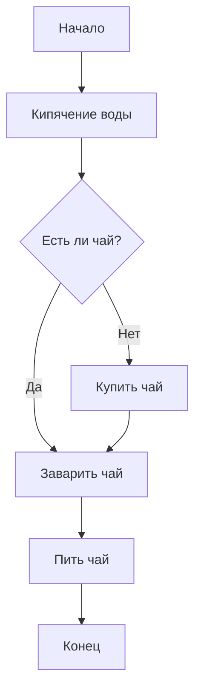
```mermaid
flowchart TD
    A[Начало] --> B[Кипячение воды]
    B --> C{Есть ли чай?}
    
    C -- Да --> D[Заварить чай]
    
    C -- Нет --> E[Купить чай]
    E --> D
    
    D --> F[Пить чай]
    F --> G[Конец]
```
1.2
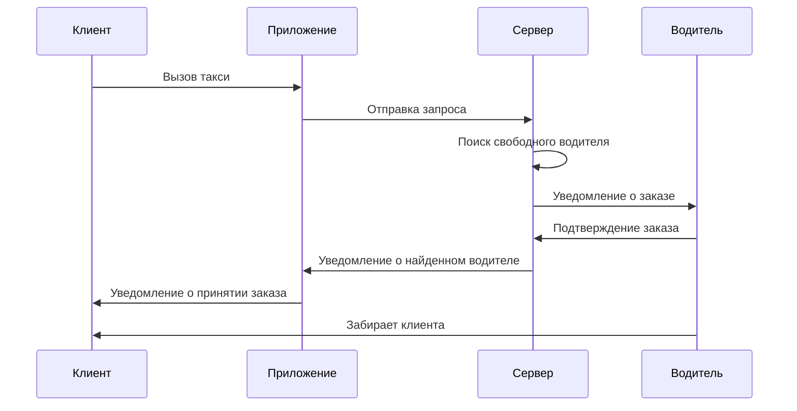
```mermaid
sequenceDiagram
    participant Клиент
    participant Приложение
    participant Сервер
    participant Водитель
    
    Клиент->>Приложение: Вызов такси
    Приложение->>Сервер: Отправка запроса
    Сервер->>Сервер: Поиск свободного водителя
    Сервер->>Водитель: Уведомление о заказе
    Водитель->>Сервер: Подтверждение заказа
    Сервер->>Приложение: Уведомление о найденном водителе
    Приложение->>Клиент: Уведомление о принятии заказа
    Водитель->>Клиент: Забирает клиента
```
2.1
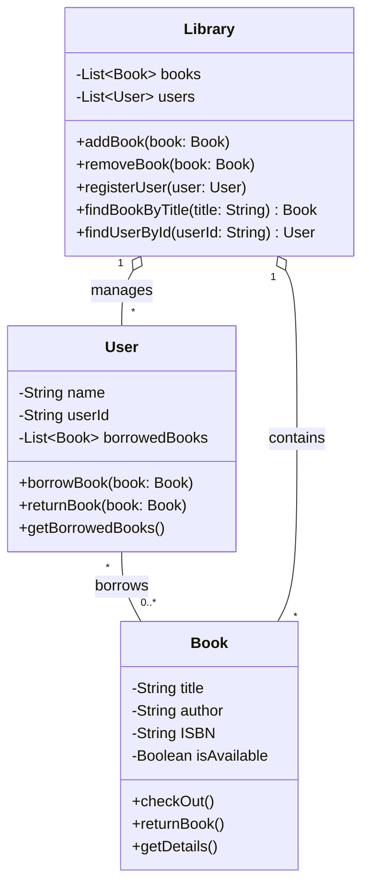
```mermaid
classDiagram
    class Book {
        -String title
        -String author
        -String ISBN
        -Boolean isAvailable
        +checkOut()
        +returnBook()
        +getDetails()
    }
    
    class User {
        -String name
        -String userId
        -List~Book~ borrowedBooks
        +borrowBook(book: Book)
        +returnBook(book: Book)
        +getBorrowedBooks()
    }
    
    class Library {
        -List~Book~ books
        -List~User~ users
        +addBook(book: Book)
        +removeBook(book: Book)
        +registerUser(user: User)
        +findBookByTitle(title: String) Book
        +findUserById(userId: String) User
    }
    
    User "*" -- "0..*" Book : borrows
    Library "1" o-- "*" Book : contains
    Library "1" o-- "*" User : manages
```
2.2
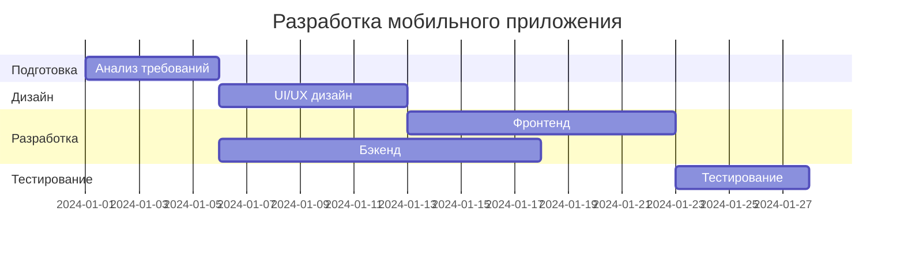
```mermaid
gantt
    title Разработка мобильного приложения
    dateFormat  YYYY-MM-DD
    section Подготовка
    Анализ требований   :a1, 2024-01-01, 5d
    section Дизайн
    UI/UX дизайн        :a2, after a1, 7d
    section Разработка
    Фронтенд            :a3, after a2, 10d
    Бэкенд              :a4, after a1, 12d
    section Тестирование
    Тестирование        :a5, after a3 a4, 5d
```
3.1
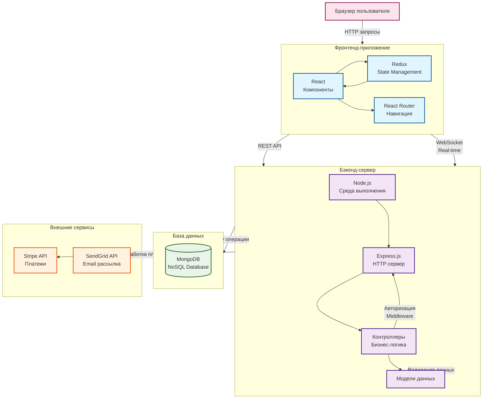
```mermaid
graph TD
    %% Основные узлы
    Browser[Браузер пользователя]
    
    %% Subgraph для Frontend
    subgraph Frontend [Фронтенд-приложение]
        direction LR
        React[React<br/>Компоненты]
        Redux[Redux<br/>State Management]
        Router[React Router<br/>Навигация]
        
        React --> Redux
        React --> Router
        Redux --> React
    end
    
    %% Subgraph для Backend
    subgraph Backend [Бэкенд-сервер]
        direction LR
        Node[Node.js<br/>Среда выполнения]
        Express[Express.js<br/>HTTP сервер]
        Controllers[Контроллеры<br/>Бизнес-логика]
        Models[Модели данных]
        
        Node --> Express
        Express --> Controllers
        Controllers --> Models
    end
    
    %% Subgraph для Базы данных
    subgraph Database [База данных]
        MongoDB[(MongoDB<br/>NoSQL Database)]
    end
    
    %% Subgraph для Внешних сервисов
    subgraph ExternalServices [Внешние сервисы]
        direction TB
        Stripe[Stripe API<br/>Платежи]
        SendGrid[SendGrid API<br/>Email рассылка]
    end
    
    %% Связи между компонентами
    Browser -- HTTP запросы --> Frontend
    Frontend -- REST API --> Backend
    Backend -- CRUD операции --> Database
    
    %% Связи с внешними сервисами
    Backend -- Обработка платежей --> Stripe
    Backend -- Отправка email --> SendGrid
    
    %% Дополнительные связи
    Frontend -- WebSocket<br/>Real-time --> Backend
    Backend -- Валидация данных --> Models
    Controllers -- Авторизация<br/>Middleware --> Express
    
    %% Стили для наглядности
    classDef frontend fill:#e1f5fe,stroke:#01579b,stroke-width:2px
    classDef backend fill:#f3e5f5,stroke:#4a148c,stroke-width:2px
    classDef database fill:#e8f5e8,stroke:#1b5e20,stroke-width:2px
    classDef external fill:#fff3e0,stroke:#e65100,stroke-width:2px
    classDef browser fill:#fce4ec,stroke:#880e4f,stroke-width:2px
    
    class React,Redux,Router frontend
    class Node,Express,Controllers,Models backend
    class MongoDB database
    class Stripe,SendGrid external
    class Browser browser
```
3.2
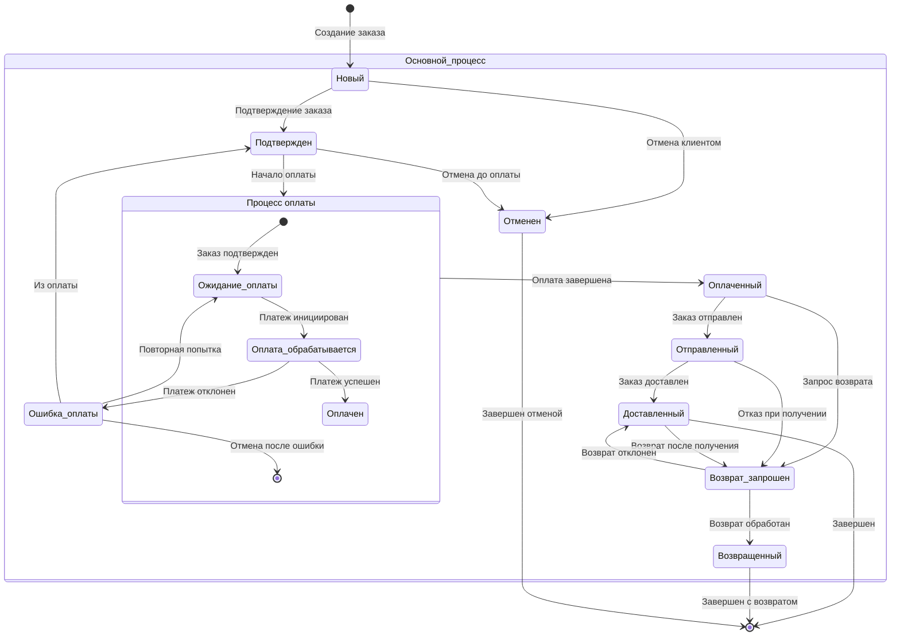
```mermaid
stateDiagram-v2
    [*] --> Новый : Создание заказа
    
    state "Процесс оплаты" as Оплата {
        [*] --> Ожидание_оплаты : Заказ подтвержден
        Ожидание_оплаты --> Оплата_обрабатывается : Платеж инициирован
        Оплата_обрабатывается --> Оплачен : Платеж успешен
        Оплата_обрабатывается --> Ошибка_оплаты : Платеж отклонен
        
        Ошибка_оплаты --> Ожидание_оплаты : Повторная попытка
        Ошибка_оплаты --> [*] : Отмена после ошибки
    }
    
    state Основной_процесс {
        Новый --> Подтвержден : Подтверждение заказа
        Подтвержден --> Оплата : Начало оплаты
        Оплата --> Оплаченный : Оплата завершена
        Оплаченный --> Отправленный : Заказ отправлен
        Отправленный --> Доставленный : Заказ доставлен
        
        %% Альтернативные пути
        Новый --> Отменен : Отмена клиентом
        Подтвержден --> Отменен : Отмена до оплаты
        Оплаченный --> Возврат_запрошен : Запрос возврата
        Отправленный --> Возврат_запрошен : Отказ при получении
        Доставленный --> Возврат_запрошен : Возврат после получения
        
        Возврат_запрошен --> Возвращенный : Возврат обработан
        Возврат_запрошен --> Доставленный : Возврат отклонен
        
        %% Возврат в предыдущие состояния
        Ошибка_оплаты --> Подтвержден : Из оплаты
    }
    
    %% Конечные состояния
    Доставленный --> [*] : Завершен
    Возвращенный --> [*] : Завершен с возвратом
    Отменен --> [*] : Завершен отменой
```
4.1
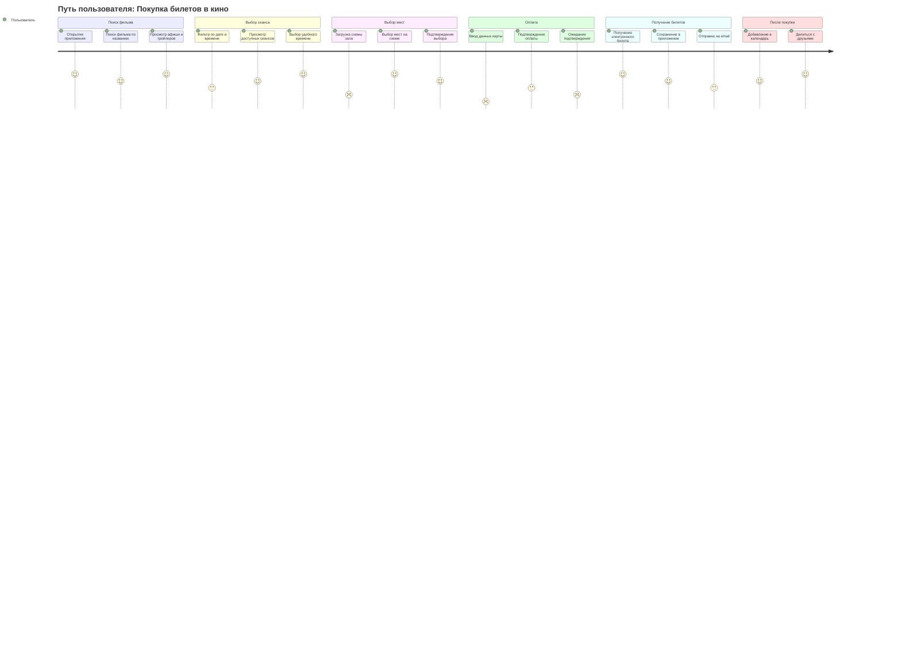
```mermaid
journey
    title Путь пользователя: Покупка билетов в кино
    section Поиск фильма
      Открытие приложения: 5: Пользователь
      Поиск фильма по названию: 4: Пользователь
      Просмотр афиши и трейлеров: 5: Пользователь
    section Выбор сеанса
      Фильтр по дате и времени: 3: Пользователь
      Просмотр доступных сеансов: 4: Пользователь
      Выбор удобного времени: 5: Пользователь
    section Выбор мест
      Загрузка схемы зала: 2: Пользователь
      Выбор мест на схеме: 5: Пользователь
      Подтверждение выбора: 4: Пользователь
    section Оплата
      Ввод данных карты: 1: Пользователь
      Подтверждение оплаты: 3: Пользователь
      Ожидание подтверждения: 2: Пользователь
    section Получение билетов
      Получение электронного билета: 5: Пользователь
      Сохранение в приложении: 4: Пользователь
      Отправка на email: 3: Пользователь
    section После покупки
      Добавление в календарь: 4: Пользователь
      Делиться с друзьями: 5: Пользователь
```

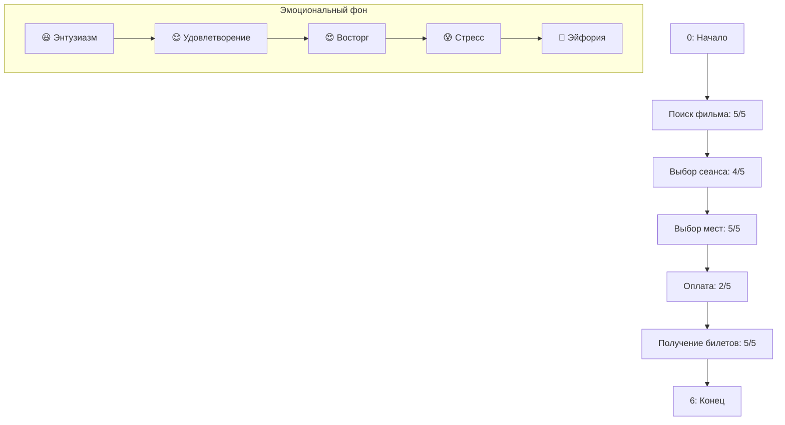
```mermaid
graph TD
    A[0: Начало] --> B[Поиск фильма: 5/5]
    B --> C[Выбор сеанса: 4/5]
    C --> D[Выбор мест: 5/5]
    D --> E[Оплата: 2/5]
    E --> F[Получение билетов: 5/5]
    F --> G[6: Конец]
    
    %% Эмоциональные состояния
    subgraph "Эмоциональный фон"
        B_emo[😃 Энтузиазм] --> C_emo[😌 Удовлетворение]
        C_emo --> D_emo[😍 Восторг]
        D_emo --> E_emo[😰 Стресс]
        E_emo --> F_emo[🎉 Эйфория]
    end
```
4.2
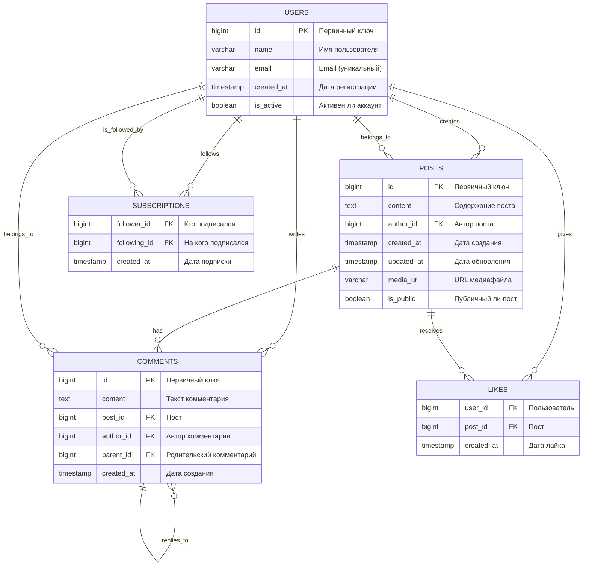
```mermaid
erDiagram
    %% Сущности
    USERS {
        bigint id PK "Первичный ключ"
        varchar name "Имя пользователя"
        varchar email "Email (уникальный)"
        timestamp created_at "Дата регистрации"
        boolean is_active "Активен ли аккаунт"
    }
    
    POSTS {
        bigint id PK "Первичный ключ"
        text content "Содержание поста"
        bigint author_id FK "Автор поста"
        timestamp created_at "Дата создания"
        timestamp updated_at "Дата обновления"
        varchar media_url "URL медиафайла"
        boolean is_public "Публичный ли пост"
    }
    
    COMMENTS {
        bigint id PK "Первичный ключ"
        text content "Текст комментария"
        bigint post_id FK "Пост"
        bigint author_id FK "Автор комментария"
        bigint parent_id FK "Родительский комментарий"
        timestamp created_at "Дата создания"
    }
    
    LIKES {
        bigint user_id FK "Пользователь"
        bigint post_id FK "Пост"
        timestamp created_at "Дата лайка"
    }
    
    SUBSCRIPTIONS {
        bigint follower_id FK "Кто подписался"
        bigint following_id FK "На кого подписался"
        timestamp created_at "Дата подписки"
    }
    
    %% Отношения
    USERS ||--o{ POSTS : creates
    USERS ||--o{ COMMENTS : writes
    USERS ||--o{ LIKES : gives
    USERS ||--o{ SUBSCRIPTIONS : follows
    USERS ||--o{ SUBSCRIPTIONS : is_followed_by
    
    POSTS ||--o{ COMMENTS : has
    POSTS ||--o{ LIKES : receives
    COMMENTS }o--|| COMMENTS : replies_to
    POSTS }o--|| USERS : belongs_to
    COMMENTS }o--|| USERS : belongs_to
```
5
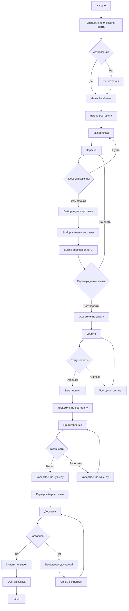
```mermaid
flowchart TD
    Start[Начало] --> A[Открытие приложения/сайта]
    A --> B{Авторизация}
    
    B -- Да --> C[Личный кабинет]
    B -- Нет --> D[Регистрация]
    D --> C
    
    C --> E[Выбор ресторана]
    E --> F[Выбор блюд]
    F --> G[Корзина]
    
    G --> H{Проверка корзины}
    H -- Пусто --> F
    H -- Есть товары --> I[Выбор адреса доставки]
    
    I --> J[Выбор времени доставки]
    J --> K[Выбор способа оплаты]
    
    K --> L{Подтверждение заказа}
    L -- Подтвердить --> M[Оформление заказа]
    L -- Изменить --> G
    
    M --> N[Оплата]
    
    N --> O{Статус оплаты}
    O -- Успешно --> P[Заказ принят]
    O -- Ошибка --> Q[Повторная оплата]
    Q --> N
    
    P --> R[Уведомление ресторану]
    R --> S[Приготовление]
    
    S --> T{Готовность}
    T -- Готово --> U[Уведомление курьеру]
    T -- Задержка --> V[Уведомление клиенту]
    V --> S
    
    U --> W[Курьер забирает заказ]
    W --> X[Доставка]
    
    X --> Y{Доставлен?}
    Y -- Да --> Z[Клиент получает]
    Y -- Нет --> AA[Проблема с доставкой]
    AA --> AB[Связь с клиентом]
    AB --> X
    
    Z --> AC[Оценка заказа]
    AC --> AD[Конец]
```
6
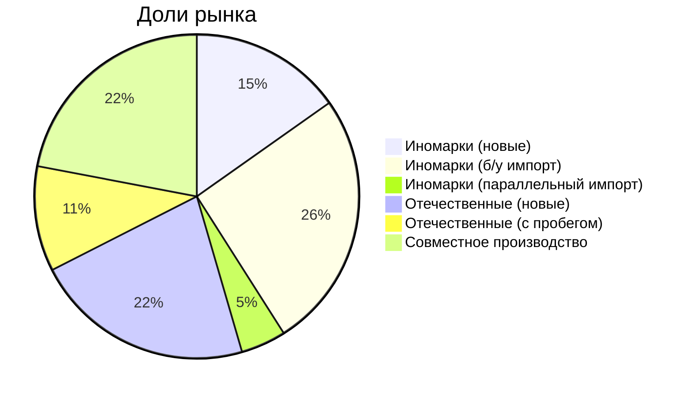
```mermaid
pie title Доли рынка
    "Иномарки (новые)" : 15.2
    "Иномарки (б/у импорт)" : 25.8
    "Иномарки (параллельный импорт)" : 4.5
    "Отечественные (новые)" : 22.0
    "Отечественные (с пробегом)" : 10.5
    "Совместное производство" : 22.0
```